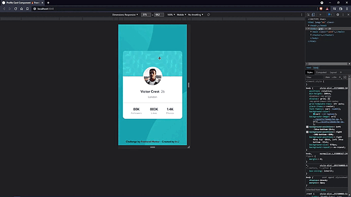
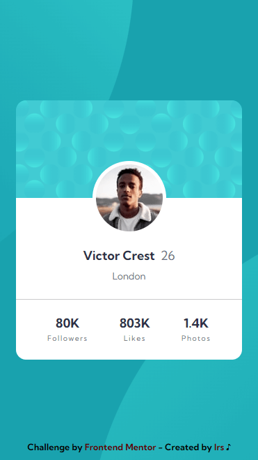

# Frontend Mentor - Profile card component solution

Hi 👋  
This is a solution to the [Profile card component challenge on Frontend Mentor](https://www.frontendmentor.io/challenges/profile-card-component-cfArpWshJ).   
If you like my solution, give me a 🌟

## Table of contents

- [Overview](#overview)
  - [The challenge](#the-challenge)
  - [Screenshot](#screenshot)
  - [Links](#links)
- [My process](#my-process)
  - [Built with](#built-with)
- [Author](#author)

## Overview

### The challenge

- Build out the project to the designs provided

### Screenshot

- Sample

- Mobile

- Desktop

### Links

- [Live site URL here](https://your-live-site-url.com) 👀

## My process

### Built with

- Mobile-first workflow
- Semantic HTML5 markup
- CSS custom properties
- CSS Grid
- Flexbox

## Author

- Frontend Mentor - [@Irs-mp](https://www.frontendmentor.io/profile/Irs-mp)
- Twitter - [@Irs_mp](https://twitter.com/Irs_mp)
